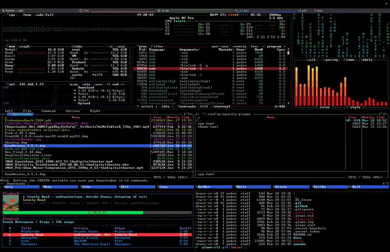
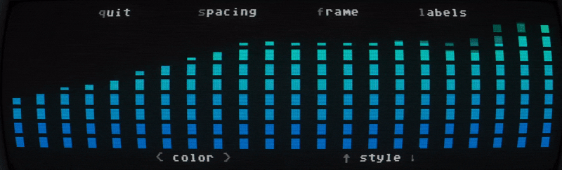

# Deciblast 

A very simple audio spectrum visualiser made with Python.

### Features
* Auto adjusts to terminal/pane size.
* Captures sound from default output, in MacOS only with microphone input (for now).
* Audio gain auto adjusts to current ambient noise to keep the bars alive (when in silence it is more sensitive).
* Various color gradients.
* Various bar styles.
* Configurable bar spacing.
* Various frame colors.
* Frame on/off.
* Labels on/off.
* Current config is automatically saved and next time it boots, it will look the same.

### Preview
* How it looks on a full screen terminal:

* I use it in a pane on my Iterm2 layout like this:

* Running on cool-retro-term:

